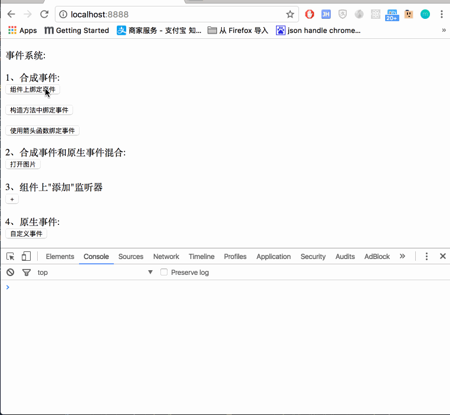

### 1、简介

本 Demo 展示了 React 组件的生命周期

### 2、运行步骤

* 1、git clone https://github.com/githubchen001/react-lesson.git

* 2、cd react-lesson/lesson03/12-eventsys

* 3、yarn install

* 4、yarn start

* 5、在浏览器中输入 localhost:8888 即可看到结果

### 3、Demo对应的文章

[![jianshu][jianshusvg]][jianshu]

[jianshusvg]: https://img.shields.io/badge/简书-eventsystem-brightgreen.svg

[jianshu]:http://www.jianshu.com/p/99dc37f9edf3
